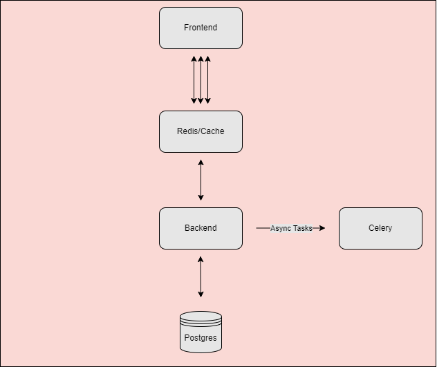

# Redis, Celery and Postgres

Three concepts a good consumer facing API should include are caching, latency and persistence. In this project we add all three to our math app. 



- [How it works](#how-it-works)
    - [Prerequisites](#prerequisites)
    - [Redis for caching](#redis-for-caching)
    - [Celery for background tasks](#celery-for-background-tasks)
    - [Postgres for persistence](#postgres-for-persistence)
- [Security](#security)
- [Testing](#testing)
- [Resources](#resources)

# Prerequisites

You should have a working version of the [math-app](#www.github.com) from last project. Here are the commands to install [redis](#https://redis.io/docs/latest/operate/oss_and_stack/install/[install-redis/install-redis-on-linux/), [celery](#https://docs.celeryq.dev/en/stable/django/first-steps-with-django.html),[loadtest](#https://www.npmjs.com/package/loadtest) and finally [postgres](#https://www.postgresql.org/download/linux/ubuntu/).

# How it Works

With three new technologies in play, let's break down what each one is doing with examples. 

## Redis for caching

Why would we use Redis here? Well let's say instead of just five questions on the site you have 500. That would take a long time to load and since the questions themselves won't change, you can use caching to store that response. It keeps the user happy. 

Once you've installed Redis, also add the module to your `venv` with `pip install django-redis`. Restart the django server and add this into your `settings.py` for your Django app:
```
CACHES = {
    "default": {
        "BACKEND": "django_redis.cache.RedisCache",
        "LOCATION": "redis://127.0.0.1:6379/1",
        "OPTIONS": {
            "CLIENT_CLASS": "django_redis.client.DefaultClient"
        },
        "KEY_PREFIX": "math-app"
    }
}
CACHE_TTL = 60 * 15 # 15 minutes
```
So we'll want to measure how our app performs now before we improve things. Let's use `loadtest`:
```
loadtest -n 500 -k http://localhost:8000/api/questions

Target URL:          http://localhost:8000/api/questions
Max requests:        500
Concurrent clients:  40
Running on cores:    4
Agent:               keepalive

Completed requests:  500
Total errors:        0
Total time:          3.2 s
Mean latency:        170.6 ms
Effective rps:       156

Percentage of requests served within a certain time
  50%      63 ms
  90%      98 ms
  95%      1093 ms
  99%      3165 ms
 100%      3176 ms (longest request)
```
We'll replace the views.py file with the one in this dir, et voila:
```
loadtest -n 500 -k http://localhost:8000/api/questions

Target URL:          http://localhost:8000/api/questions
Max requests:        500
Concurrent clients:  40
Running on cores:    4
Agent:               keepalive

Completed requests:  500
Total errors:        0
Total time:          3.613 s
Mean latency:        206.8 ms
Effective rps:       138

Percentage of requests served within a certain time
  50%      69 ms
  90%      110 ms
  95%      1327 ms
  99%      2913 ms
 100%      3181 ms (longest request)
 ```

In this particular instance, I only had a small amount of questions. We'd want to have a much larger response to really reap the benefits.

## Celery for background tasks

Many times you don't want your API to block Users from doing stuff. If for whatever reason 1000 people are resetting their passwords at the same time the server will be bogged down with such requests. You can have some worker do this asynchronously instead. 

Right now we can make sure our email sending is working by opening a new terminal and running a local smtp server (saves the hassle of doing this with an external service like Gmail): `python3 -m smtpd -n -c DebuggingServer localhost:8025`. Try getting a 'Forgot password' email from the login screen and you should see the html response in the console. 

Now let's add celery module: `python3 -m pip install celery`. Celery receives instructions but needs a message broker to receive them. Redis, which we just got working is ideal for this, make sure it's still up and running.

Next, we'll:
- Copy the `celery.py` file into our `backend` directory
- Add these lines to `settings.py` (already done):
```
CELERY_BROKER_URL = "redis://localhost:6379"
CELERY_RESULT_BACKEND = "redis://localhost:6379"
```
- Overwrite the blank `__init__.py` file in the backend dir with the one in this repo

Make sure it's all working by running a terminal with the venv activated: `python3 -m celery -A backend worker`. Warnings are ok; as long as it starts.

Now we're going to overwrite the changes in our app. We'll copy in `tasks.py` and overwrite `views.py`. Once done, make sure you have four terminals running processes:

1. Frontend with npm/React app
2. Backend Django server
3. A local smtp server with `python3 -m smtpd -n -c DebuggingServer localhost:8025`
4. Your celery server: `python3 -m celery -A backend worker -l info`

Also make sure redis is running in the background (use the ping command as above). Once all that is done, you can use the ForgotPassword option on the UI. Once you submit, you should see html pop up in your redis server along with something like this in your celery terminal: 
```
[2024-10-18 08:59:06,535: INFO/ForkPoolWorker-6] Task api.tasks.send_forgot_password_email[8b54717e-3018-409e-aea4-1fdff5e13d42] succeeded in 0.07219693499791902s: None
```

## Postgres for persistence

In our previous project, we used something called sqlite, which provides a minimal SQL interface in place of a dedicated database. But notice how we have to populate it every time. If the filesystem got destroyed, so will the data. 

Here we're still working locally, but will take steps to use a proper DB so as to set ourselves up for using in the cloud in future where it will be highly available and extremely online. Here's how we'll configure a Postgres db in our settings file:
```
DATABASES = {
    'default': {
        'ENGINE': 'django.db.backends.postgresql',
        'NAME': 'postgres',
        'USER': 'postgres',
        'PASSWORD': 'postgres',
        'HOST': 'localhost',
        'PORT': 5432,
    },
}
```
Once you save this, your console will exclaim that you need to migrate. This makes sense: the new db has no Users, Questions, etc:
```
source venv/bin/activate
cd backend/
python3 manage.py makemigrations
python3 manage.py migrate --run-syncdb
python3 manage.py createsuperuser # follow the steps
```
You can now make questions in the admin site. 

## Testing

1. psql can list questions: `sudo -u postgres psql -c "SELECT * FROM api_question;" postgres`
2. Redis is working: `redis-cli ping`
3. Celery is working good and is connected to our task: `python3 -m celery -A backend worker -l info`

## Security

For the purposes of demonstration, security is noticably absent in this demo. A few things would need to be rectified:

1. For Postgres access, we will absolutely need to store credentials out of settings.py file. We'll cover this further in secrets and configuation management
2. From the first app, we use a plaintext SALT to hash an email in views.py. Again this should be not in plain text and/or auto-generated just as we do with the uuid in the tasks.py.
3. SMTP servers are fine for local testing but later we may want a better option. Again this will fall under secrets & config management. 

# Resources

- [Virtual Env Wrapper](https://virtualenvwrapper.readthedocs.io/en/latest/install.html)
- [Redis](https://realpython.com/caching-in-django-with-redis/)
- [Celery](https://realpython.com/asynchronous-tasks-with-django-and-celery/)